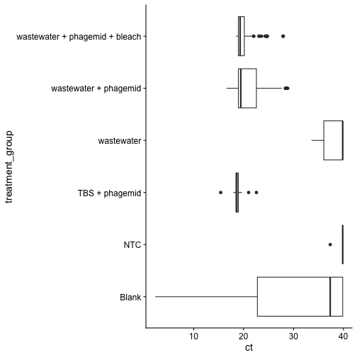
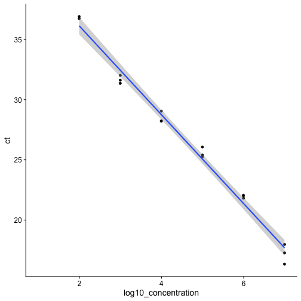
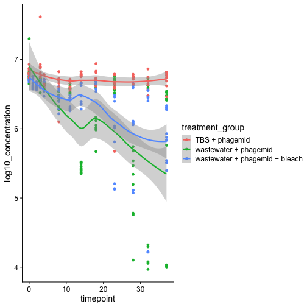
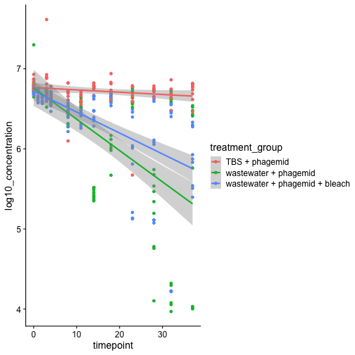
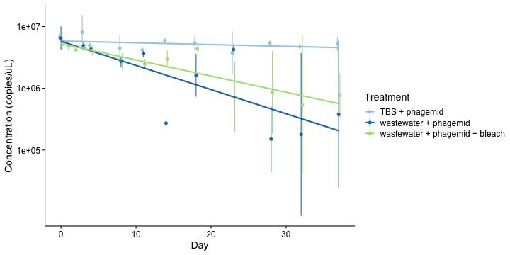
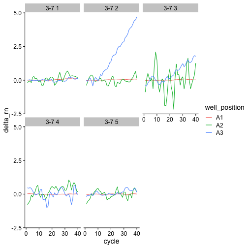
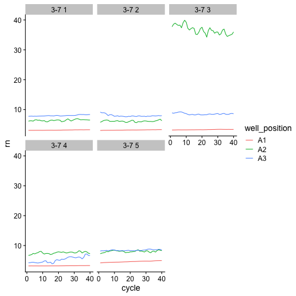
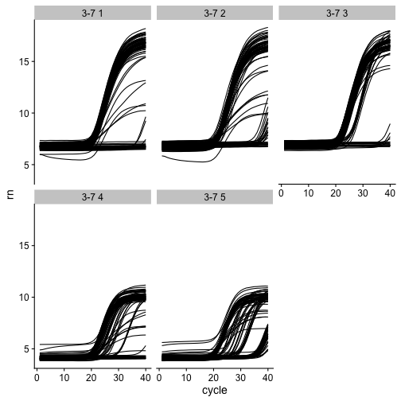

```r
library(tidyverse)
library(readxl)
library(broom)
library(knitr)
```


```r
theme_set(cowplot::theme_cowplot())
```


# Ingest data

The qPCR machine outputs its data in excel files.
For this experiment, we can find the files [in our lab google drive](https://drive.google.com/drive/folders/1PntkFBFwNZfeXndBdq1k72ilLebwPbQd?usp=share_link).
Eventually, we might want to automate access to the data, but for now, we'll manually download excel files and save to the `data/` directory.
In this document, we'll be looking at the 11-day-qpcr experiment.

## Read qPCR data from excel files

For each plate, we'll read the "Results" sheet.
The first 42 rows of the sheet are metadata that we don't need, so we'll skip them.
We'll also save the path in a column called "source_file" so we can look for plate effects if we'd like after we merge files.

We're only going to keep a subset of columns.
In the next block we extract the columns we want and convert them to the correct datatypes.

* `CT`: the Ct value. Either "Undetermined" or a number. We'll use `as.numeric` to convert from a character string to a number (double).
* `Sample Name` labels the content of the samples
* `Well Position` is the alphanumeric plate well ID (e.g., "A01"). Note: this is redundant with `Sample Name` here, but in the future we may want to automatically label the samples from `Well Position` using a plate layout file.
* `Ct Threshold`. These should all be `0.2`. We will check that for quality control.
* `Automatic Ct Threshold`. These should all be `FALSE`
* `Target Name` can be used to distinguish experimental samples ("Barcode_1") from blanks ("Blank") and NTCs ("Barcode_1_NTC"). We'll encode these as factors because they have a limited set of values.

We'll also rename the columns consistently in "snake case" (i.e., all lowercase with underscores separating the words.)

In the future we may want to redo the baseline subtraction manually, but for now, we'll ignore those columns.


```r
read_qpcr_excel <- function(path) {
  read_excel(
    path = path,
    sheet = "Results",
    skip = 42
  ) |>
  transmute(
    source_file = path,
    ct = as.numeric(CT),
    sample_name = `Sample Name`,
    well_position = `Well Position`,
    ct_threshold = `Ct Threshold`,
    auto_ct_threshold = `Automatic Ct Threshold`,
    target_name = as.factor(`Target Name`)
  )
}
```
TODO: It would be nice to specify what values to convert to `NA` quietly.


```r
data_dir <- "data/37-day-qpcr"
filename_pattern <- "3-7 [0-9]+[.]xls"
data_raw <- list.files(
  data_dir,
  pattern = filename_pattern,
  full.names = TRUE
  ) |>
  map(read_qpcr_excel) |>
  list_rbind()
```

```
## Warning in mask$eval_all_mutate(quo): NAs introduced by coercion

## Warning in mask$eval_all_mutate(quo): NAs introduced by coercion

## Warning in mask$eval_all_mutate(quo): NAs introduced by coercion

## Warning in mask$eval_all_mutate(quo): NAs introduced by coercion

## Warning in mask$eval_all_mutate(quo): NAs introduced by coercion
```

```r
kable(head(data_raw, n = 10))
```


|source_file                |       ct|sample_name |well_position | ct_threshold|auto_ct_threshold |target_name |
|:--------------------------|--------:|:-----------|:-------------|------------:|:-----------------|:-----------|
|data/37-day-qpcr/3-7 1.xls |       NA|Blank       |A1            |          0.2|FALSE             |Blank       |
|data/37-day-qpcr/3-7 1.xls | 24.62305|Blank       |A2            |          0.2|FALSE             |Blank       |
|data/37-day-qpcr/3-7 1.xls | 33.02121|Blank       |A3            |          0.2|FALSE             |Blank       |
|data/37-day-qpcr/3-7 1.xls | 18.72317|A0.1        |A4            |          0.2|FALSE             |18          |
|data/37-day-qpcr/3-7 1.xls | 18.59926|A0.1        |A5            |          0.2|FALSE             |18          |
|data/37-day-qpcr/3-7 1.xls | 18.67014|A0.1        |A6            |          0.2|FALSE             |18          |
|data/37-day-qpcr/3-7 1.xls | 18.97527|A0.2        |A7            |          0.2|FALSE             |18          |
|data/37-day-qpcr/3-7 1.xls | 18.45458|A0.2        |A8            |          0.2|FALSE             |18          |
|data/37-day-qpcr/3-7 1.xls | 18.30861|A0.2        |A9            |          0.2|FALSE             |18          |
|data/37-day-qpcr/3-7 1.xls | 18.39762|A0.3        |A10           |          0.2|FALSE             |18          |

For quality control, let's check assertions our assertions about about `ct_threshold` and `autothreshold`.


```r
expected_ct_threshold <- 0.2
data_raw |>
  summarize(
    all_auto_ct_theshold_false = all(!auto_ct_threshold),
    all_ct_theshold_expected = all(ct_threshold == expected_ct_threshold)
  )
```

```
## # A tibble: 1 × 2
##   all_auto_ct_theshold_false all_ct_theshold_expected
##   <lgl>                      <lgl>                   
## 1 TRUE                       TRUE
```

## Tidy the data

Currently we have the `sample_name` column, which contains three pieces of information: the experiment (e.g., "A", "B", ...), the timepoint, and the technical replicate number.
To make the data tidier, we'll split this into separate columns.

We will use regular expressions to match the expected pattern, which is:

1. The start of the string
2. The treatment group, specified by one or more letters
3. The timepoint, specified by one or more numbers
4. A dash
5. The technical replicate, specified by one or more numbers
6. The end of the string

Finally, we'll rename the single-letter treatment groups with more informative names and mark the negative controls so we can separate them out later.


```r
coding = list(
  "A" = "wastewater + phagemid",
  "B" = "wastewater + phagemid + bleach",
  "C" = "TBS + phagemid",
  "D" = "wastewater"
)

controls <-  c("Blank", "NTC", "wastewater")

sample_name_pattern = c(
  "^",
  treatment_group = "[A-Za-z]+",
  timepoint = "[0-9]+",
  "\\-",
  tech_rep = "[0-9]+",
  "$"
)

data_tidy <- data_raw |>
  mutate(
    sample_name = str_replace(sample_name, "B1_NTC", "NTC")
  ) |>
  separate_wider_regex(
    sample_name,
    patterns = sample_name_pattern,
    too_few = "align_start"
  ) |>
  mutate(
    treatment_group = recode(treatment_group, !!!coding),
    control = treatment_group %in% controls,
    timepoint = as.integer(timepoint),
    tech_rep = as.factor(tech_rep)
  )
kable(head(data_tidy, n = 10))
```


|source_file                |       ct|treatment_group       | timepoint|tech_rep |well_position | ct_threshold|auto_ct_threshold |target_name |control |
|:--------------------------|--------:|:---------------------|---------:|:--------|:-------------|------------:|:-----------------|:-----------|:-------|
|data/37-day-qpcr/3-7 1.xls |       NA|Blank                 |        NA|NA       |A1            |          0.2|FALSE             |Blank       |TRUE    |
|data/37-day-qpcr/3-7 1.xls | 24.62305|Blank                 |        NA|NA       |A2            |          0.2|FALSE             |Blank       |TRUE    |
|data/37-day-qpcr/3-7 1.xls | 33.02121|Blank                 |        NA|NA       |A3            |          0.2|FALSE             |Blank       |TRUE    |
|data/37-day-qpcr/3-7 1.xls | 18.72317|wastewater + phagemid |         0|NA       |A4            |          0.2|FALSE             |18          |FALSE   |
|data/37-day-qpcr/3-7 1.xls | 18.59926|wastewater + phagemid |         0|NA       |A5            |          0.2|FALSE             |18          |FALSE   |
|data/37-day-qpcr/3-7 1.xls | 18.67014|wastewater + phagemid |         0|NA       |A6            |          0.2|FALSE             |18          |FALSE   |
|data/37-day-qpcr/3-7 1.xls | 18.97527|wastewater + phagemid |         0|NA       |A7            |          0.2|FALSE             |18          |FALSE   |
|data/37-day-qpcr/3-7 1.xls | 18.45458|wastewater + phagemid |         0|NA       |A8            |          0.2|FALSE             |18          |FALSE   |
|data/37-day-qpcr/3-7 1.xls | 18.30861|wastewater + phagemid |         0|NA       |A9            |          0.2|FALSE             |18          |FALSE   |
|data/37-day-qpcr/3-7 1.xls | 18.39762|wastewater + phagemid |         0|NA       |A10           |          0.2|FALSE             |18          |FALSE   |

Let's make sure we have 24 blanks, 23 NTCs, 45 wastewater + phagemid and TBS + phagement (3 pcr replicates * 3 technical replicates * 5 timepoints), 63 bleach and wastewater (7 timepoints).

```r
data_tidy |>
  group_by(treatment_group) |>
  count() |>
  kable()
```


|treatment_group                |   n|
|:------------------------------|---:|
|Blank                          |  15|
|NTC                            |  15|
|TBS + phagemid                 |  99|
|wastewater                     | 117|
|wastewater + phagemid          |  99|
|wastewater + phagemid + bleach | 117|

TODO: Relabel the missing wastewater wells.

First, let's take a look at the Blanks and NTCs. These should mostly have `NA` for their ct value.

```r
data_tidy |>
  filter(treatment_group == "Blank" | treatment_group == "NTC") |>
  kable()
```


|source_file                |        ct|treatment_group | timepoint|tech_rep |well_position | ct_threshold|auto_ct_threshold |target_name |control |
|:--------------------------|---------:|:---------------|---------:|:--------|:-------------|------------:|:-----------------|:-----------|:-------|
|data/37-day-qpcr/3-7 1.xls |        NA|Blank           |        NA|NA       |A1            |          0.2|FALSE             |Blank       |TRUE    |
|data/37-day-qpcr/3-7 1.xls | 24.623054|Blank           |        NA|NA       |A2            |          0.2|FALSE             |Blank       |TRUE    |
|data/37-day-qpcr/3-7 1.xls | 33.021214|Blank           |        NA|NA       |A3            |          0.2|FALSE             |Blank       |TRUE    |
|data/37-day-qpcr/3-7 1.xls |        NA|NTC             |        NA|NA       |B1            |          0.2|FALSE             |B1_NTC      |TRUE    |
|data/37-day-qpcr/3-7 1.xls |        NA|NTC             |        NA|NA       |B2            |          0.2|FALSE             |B1_NTC      |TRUE    |
|data/37-day-qpcr/3-7 1.xls |        NA|NTC             |        NA|NA       |B3            |          0.2|FALSE             |B1_NTC      |TRUE    |
|data/37-day-qpcr/3-7 2.xls |        NA|Blank           |        NA|NA       |A1            |          0.2|FALSE             |Blank       |TRUE    |
|data/37-day-qpcr/3-7 2.xls |        NA|Blank           |        NA|NA       |A2            |          0.2|FALSE             |Blank       |TRUE    |
|data/37-day-qpcr/3-7 2.xls | 11.405957|Blank           |        NA|NA       |A3            |          0.2|FALSE             |Blank       |TRUE    |
|data/37-day-qpcr/3-7 2.xls |        NA|NTC             |        NA|NA       |B1            |          0.2|FALSE             |B1_NTC      |TRUE    |
|data/37-day-qpcr/3-7 2.xls |        NA|NTC             |        NA|NA       |B2            |          0.2|FALSE             |B1_NTC      |TRUE    |
|data/37-day-qpcr/3-7 2.xls |        NA|NTC             |        NA|NA       |B3            |          0.2|FALSE             |B1_NTC      |TRUE    |
|data/37-day-qpcr/3-7 3.xls |        NA|Blank           |        NA|NA       |A1            |          0.2|FALSE             |Blank       |TRUE    |
|data/37-day-qpcr/3-7 3.xls |  2.297342|Blank           |        NA|NA       |A2            |          0.2|FALSE             |Blank       |TRUE    |
|data/37-day-qpcr/3-7 3.xls | 20.893080|Blank           |        NA|NA       |A3            |          0.2|FALSE             |Blank       |TRUE    |
|data/37-day-qpcr/3-7 3.xls |        NA|NTC             |        NA|NA       |B1            |          0.2|FALSE             |B1_NTC      |TRUE    |
|data/37-day-qpcr/3-7 3.xls | 37.365894|NTC             |        NA|NA       |B2            |          0.2|FALSE             |B1_NTC      |TRUE    |
|data/37-day-qpcr/3-7 3.xls |        NA|NTC             |        NA|NA       |B3            |          0.2|FALSE             |B1_NTC      |TRUE    |
|data/37-day-qpcr/3-7 4.xls |        NA|Blank           |        NA|NA       |A1            |          0.2|FALSE             |Blank       |TRUE    |
|data/37-day-qpcr/3-7 4.xls | 17.781605|Blank           |        NA|NA       |A2            |          0.2|FALSE             |Blank       |TRUE    |
|data/37-day-qpcr/3-7 4.xls |        NA|Blank           |        NA|NA       |A3            |          0.2|FALSE             |Blank       |TRUE    |
|data/37-day-qpcr/3-7 4.xls |        NA|NTC             |        NA|NA       |B1            |          0.2|FALSE             |B1_NTC      |TRUE    |
|data/37-day-qpcr/3-7 4.xls |        NA|NTC             |        NA|NA       |B2            |          0.2|FALSE             |B1_NTC      |TRUE    |
|data/37-day-qpcr/3-7 4.xls |        NA|NTC             |        NA|NA       |B3            |          0.2|FALSE             |B1_NTC      |TRUE    |
|data/37-day-qpcr/3-7 5.xls |        NA|Blank           |        NA|NA       |A1            |          0.2|FALSE             |Blank       |TRUE    |
|data/37-day-qpcr/3-7 5.xls | 37.355930|Blank           |        NA|NA       |A2            |          0.2|FALSE             |Blank       |TRUE    |
|data/37-day-qpcr/3-7 5.xls | 29.361135|Blank           |        NA|NA       |A3            |          0.2|FALSE             |Blank       |TRUE    |
|data/37-day-qpcr/3-7 5.xls |        NA|NTC             |        NA|NA       |B1            |          0.2|FALSE             |B1_NTC      |TRUE    |
|data/37-day-qpcr/3-7 5.xls |        NA|NTC             |        NA|NA       |B2            |          0.2|FALSE             |B1_NTC      |TRUE    |
|data/37-day-qpcr/3-7 5.xls |        NA|NTC             |        NA|NA       |B3            |          0.2|FALSE             |B1_NTC      |TRUE    |

Note that many of the Blanks have low CT values.
TODO: investigate these by looking at the raw data.

We can make a boxplot to compare the distribution of ct across treatments.
To disply the NAs, we'll set them to one more than the maximum possible values.


```r
ct_max <- max(data_tidy$ct, na.rm = TRUE) + 1
data_tidy |>
  mutate(ct = replace_na(ct, ct_max)) |>
  ggplot(mapping = aes(ct, treatment_group)) +
  geom_boxplot()
```



We see that the wastewater and NTC have high CT values, mostly NA, as expected.
Again we see that the Blanks have lower than expected CT, which we should investigate.

# Convert raw Ct values to concentrations

We would like to transform our `c_t` values to concentrations (or more specifically log concentrations).
We expect `c_t` to depend on log concentration according to the linear relationship $c_t = a \log(\text{conc}) + b$.
To estimate the coefficients $a$ and $b$, we use a *standard curve*, a series of qPCR measurements on sequentially diluted samples.
Note that we expect these coefficients to be phagemid-specific, so we will need to do a standard curve for each phagemid.

## Make the standard curve

Ari did a single dilution series with 10x dilution at each step and three qPCR measurements of each dilution.
First, we'll read the excel file produced by the qPCR machine.
We want barcode 18-04, which is "B2" in the file.

The samples in this file are labeled by their level of dilution.
We convert this label to log10 concentration.
In Ari's coding, dilution $d$ is 10x more concentrated than dilution $d-1$.
We also need to know the expected concentration at $d=0$.
In this case it's 0.9871 copies per microliter.
In the future, we should probably include uncertainty in this value.


```r
standard_curve_file <- paste("data/", "T1_QS2_018_BC49 and T1_QS2_018_BC04.xls", sep="")
concentration_at_d0 <- 0.9871
dilution_factor <- 10

sample_name_pattern_standard_curve <- c(
  "^",
  group = "[A-Za-z0-9]+",
  "_D",
  dilution = "[0-9]+",
  "$"
)

data_standard_curve <- read_qpcr_excel(standard_curve_file) |>
  separate_wider_regex(
    sample_name,
    patterns = sample_name_pattern_standard_curve,
    too_few = "align_start"
  ) |>
  mutate(dilution = as.integer(dilution)) |>
  filter(group == "B2") |>
  drop_na(dilution) |>
  mutate(log10_concentration = log10(concentration_at_d0) + log10(dilution_factor) * dilution)
```

```
## Warning in mask$eval_all_mutate(quo): NAs introduced by coercion
```

```r
kable(head(data_standard_curve, n = 10))
```


|source_file                                  |       ct|group | dilution|well_position | ct_threshold|auto_ct_threshold |target_name | log10_concentration|
|:--------------------------------------------|--------:|:-----|--------:|:-------------|------------:|:-----------------|:-----------|-------------------:|
|data/T1_QS2_018_BC49 and T1_QS2_018_BC04.xls |       NA|B2    |        1|E3            |          0.2|FALSE             |Barcode_2   |           0.9943612|
|data/T1_QS2_018_BC49 and T1_QS2_018_BC04.xls | 36.90071|B2    |        2|E4            |          0.2|FALSE             |Barcode_2   |           1.9943612|
|data/T1_QS2_018_BC49 and T1_QS2_018_BC04.xls | 31.61678|B2    |        3|E5            |          0.2|FALSE             |Barcode_2   |           2.9943612|
|data/T1_QS2_018_BC49 and T1_QS2_018_BC04.xls | 28.23690|B2    |        4|E6            |          0.2|FALSE             |Barcode_2   |           3.9943612|
|data/T1_QS2_018_BC49 and T1_QS2_018_BC04.xls | 26.06779|B2    |        5|E7            |          0.2|FALSE             |Barcode_2   |           4.9943612|
|data/T1_QS2_018_BC49 and T1_QS2_018_BC04.xls | 22.05504|B2    |        6|E8            |          0.2|FALSE             |Barcode_2   |           5.9943612|
|data/T1_QS2_018_BC49 and T1_QS2_018_BC04.xls | 17.27207|B2    |        7|E9            |          0.2|FALSE             |Barcode_2   |           6.9943612|
|data/T1_QS2_018_BC49 and T1_QS2_018_BC04.xls |       NA|B2    |        1|F3            |          0.2|FALSE             |Barcode_2   |           0.9943612|
|data/T1_QS2_018_BC49 and T1_QS2_018_BC04.xls | 36.73648|B2    |        2|F4            |          0.2|FALSE             |Barcode_2   |           1.9943612|
|data/T1_QS2_018_BC49 and T1_QS2_018_BC04.xls | 31.35515|B2    |        3|F5            |          0.2|FALSE             |Barcode_2   |           2.9943612|


```r
data_standard_curve |>
  ggplot(mapping = aes(log10_concentration, ct)) +
  geom_point() +
  geom_smooth(method = "lm")
```

```
## `geom_smooth()` using formula = 'y ~ x'
```

```
## Warning: Removed 4 rows containing non-finite values (`stat_smooth()`).
```

```
## Warning: Removed 4 rows containing missing values (`geom_point()`).
```


The common deviations from linearity at each dilution suggests pipetting error in the dilution series in addition to qPCR variation.

Fit a linear model and save the coefficients.

```r
standard_curve <- lm(ct ~ log10_concentration, data_standard_curve)
summary(standard_curve)
```

```
## 
## Call:
## lm(formula = ct ~ log10_concentration, data = data_standard_curve)
## 
## Residuals:
##     Min      1Q  Median      3Q     Max 
## -1.3603 -0.5192  0.2738  0.6095  0.9971 
## 
## Coefficients:
##                     Estimate Std. Error t value Pr(>|t|)    
## (Intercept)          43.4772     0.5286   82.25  < 2e-16 ***
## log10_concentration  -3.6855     0.1074  -34.33 1.13e-15 ***
## ---
## Signif. codes:  0 '***' 0.001 '**' 0.01 '*' 0.05 '.' 0.1 ' ' 1
## 
## Residual standard error: 0.7272 on 15 degrees of freedom
##   (4 observations deleted due to missingness)
## Multiple R-squared:  0.9874,	Adjusted R-squared:  0.9866 
## F-statistic:  1178 on 1 and 15 DF,  p-value: 1.132e-15
```

```r
std_curve_slope  <- standard_curve$coefficients["log10_concentration"]
std_curve_intercept  <- standard_curve$coefficients["(Intercept)"]
```

Note: a correct model would take into account that errors in dilution propagate to all future dilutions.

## Apply standard curve

Now we can apply the standard curve to our data.
We're also going to filter out the negative controls from now on.


```r
data_concentration <- data_tidy |>
  filter(!control) |>
  mutate(log10_concentration = (ct - std_curve_intercept) / std_curve_slope)
kable(head(data_concentration, n = 10))
```


|source_file                |       ct|treatment_group                | timepoint|tech_rep |well_position | ct_threshold|auto_ct_threshold |target_name |control | log10_concentration|
|:--------------------------|--------:|:------------------------------|---------:|:--------|:-------------|------------:|:-----------------|:-----------|:-------|-------------------:|
|data/37-day-qpcr/3-7 1.xls | 18.72317|wastewater + phagemid          |         0|NA       |A4            |          0.2|FALSE             |18          |FALSE   |            6.716666|
|data/37-day-qpcr/3-7 1.xls | 18.59926|wastewater + phagemid          |         0|NA       |A5            |          0.2|FALSE             |18          |FALSE   |            6.750287|
|data/37-day-qpcr/3-7 1.xls | 18.67014|wastewater + phagemid          |         0|NA       |A6            |          0.2|FALSE             |18          |FALSE   |            6.731054|
|data/37-day-qpcr/3-7 1.xls | 18.97527|wastewater + phagemid          |         0|NA       |A7            |          0.2|FALSE             |18          |FALSE   |            6.648261|
|data/37-day-qpcr/3-7 1.xls | 18.45458|wastewater + phagemid          |         0|NA       |A8            |          0.2|FALSE             |18          |FALSE   |            6.789544|
|data/37-day-qpcr/3-7 1.xls | 18.30861|wastewater + phagemid          |         0|NA       |A9            |          0.2|FALSE             |18          |FALSE   |            6.829150|
|data/37-day-qpcr/3-7 1.xls | 18.39762|wastewater + phagemid          |         0|NA       |A10           |          0.2|FALSE             |18          |FALSE   |            6.805000|
|data/37-day-qpcr/3-7 1.xls | 18.59225|wastewater + phagemid          |         0|NA       |A11           |          0.2|FALSE             |18          |FALSE   |            6.752189|
|data/37-day-qpcr/3-7 1.xls | 16.57587|wastewater + phagemid          |         0|NA       |A12           |          0.2|FALSE             |18          |FALSE   |            7.299307|
|data/37-day-qpcr/3-7 1.xls | 18.79744|wastewater + phagemid + bleach |         0|NA       |B4            |          0.2|FALSE             |18          |FALSE   |            6.696513|

Since we have three PCR replicates per technical replicate, we can summarize our data with min, median, and max without any loss of information.


```r
data_concentration |>
  group_by(treatment_group, timepoint, tech_rep) |>
  summarize(
    conc_min = min(log10_concentration, na.rm = TRUE),
    conc_med = median(log10_concentration, na.rm = TRUE),
    conc_max = max(log10_concentration, na.rm = TRUE),
    .groups="drop"
  ) |>
  kable()
```


|treatment_group                | timepoint|tech_rep | conc_min| conc_med| conc_max|
|:------------------------------|---------:|:--------|--------:|--------:|--------:|
|TBS + phagemid                 |         0|NA       | 6.742415| 6.806981| 6.930194|
|TBS + phagemid                 |         3|NA       | 6.664193| 6.879837| 7.615385|
|TBS + phagemid                 |         4|NA       | 6.598940| 6.708127| 6.782354|
|TBS + phagemid                 |         8|NA       | 6.098931| 6.702023| 6.822789|
|TBS + phagemid                 |        11|NA       | 6.540938| 6.603867| 6.714906|
|TBS + phagemid                 |        14|NA       | 6.668352| 6.774240| 6.822524|
|TBS + phagemid                 |        18|NA       | 6.611458| 6.723175| 6.939405|
|TBS + phagemid                 |        23|NA       | 5.673276| 6.652852| 6.788322|
|TBS + phagemid                 |        28|NA       | 6.642870| 6.745656| 6.785591|
|TBS + phagemid                 |        32|NA       | 6.474544| 6.690415| 6.862807|
|TBS + phagemid                 |        37|NA       | 6.462373| 6.765893| 6.817856|
|wastewater + phagemid          |         0|NA       | 6.648261| 6.752189| 7.299307|
|wastewater + phagemid          |         3|NA       | 6.520649| 6.704617| 6.732883|
|wastewater + phagemid          |         4|NA       | 6.557100| 6.639627| 6.672861|
|wastewater + phagemid          |         8|NA       | 6.275405| 6.452987| 6.540729|
|wastewater + phagemid          |        11|NA       | 6.488543| 6.575099| 6.654443|
|wastewater + phagemid          |        14|NA       | 5.350593| 5.432934| 5.517443|
|wastewater + phagemid          |        18|NA       | 5.671068| 6.119031| 6.697592|
|wastewater + phagemid          |        23|NA       | 6.519009| 6.588770| 6.751686|
|wastewater + phagemid          |        28|NA       | 4.102318| 5.341312| 5.741511|
|wastewater + phagemid          |        32|NA       | 3.969149| 4.321214| 6.722758|
|wastewater + phagemid          |        37|NA       | 4.002466| 6.410772| 6.539852|
|wastewater + phagemid + bleach |         0|NA       | 6.673996| 6.701867| 6.773283|
|wastewater + phagemid + bleach |         1|NA       | 6.574865| 6.706259| 6.754777|
|wastewater + phagemid + bleach |         2|NA       | 6.567894| 6.634313| 6.677856|
|wastewater + phagemid + bleach |         3|NA       | 6.593541| 6.663578| 6.709301|
|wastewater + phagemid + bleach |         4|NA       | 6.468011| 6.588984| 6.713406|
|wastewater + phagemid + bleach |         8|NA       | 6.216011| 6.452281| 6.612930|
|wastewater + phagemid + bleach |        11|NA       | 6.258684| 6.430321| 6.481479|
|wastewater + phagemid + bleach |        14|NA       | 6.284105| 6.471312| 6.657776|
|wastewater + phagemid + bleach |        18|NA       | 6.538636| 6.646926| 6.687943|
|wastewater + phagemid + bleach |        23|NA       | 5.126170| 6.010775| 6.494663|
|wastewater + phagemid + bleach |        28|NA       | 5.074937| 6.083521| 6.654263|
|wastewater + phagemid + bleach |        32|NA       | 4.218118| 6.448869| 6.558743|
|wastewater + phagemid + bleach |        37|NA       | 5.396390| 5.873906| 6.331799|

# Plot log concentrations vs time for each condition

First, we plot all the treatment groups on the same timecourse to see differences in absolute as well as relative concentration.


```r
data_concentration |>
  ggplot(
    aes(timepoint, log10_concentration, shape = treatment_group, color = treatment_group)
    ) +
  geom_point(
    position = position_jitter(height = 0, width = 0.1, seed = 3579237)
  )
```


Let's look at within- vs between-technical replicate variation:


```r
data_concentration |>
  ggplot(aes(timepoint,log10_concentration, group = tech_rep)) +
  stat_summary(
    fun.min = min,
    fun.max = max,
    fun = median,
    position = position_dodge(width = 0.2),
    size = 0.2
    ) +
  facet_wrap(
    facets = ~ treatment_group,
    )
```


# Regression analysis

In this section, we'll look at the trends in concentration over time.
First, we'll make the approximation that all of the qPCR measurements for a `(treatment_group, timepoint)` pair are independent.
This is not exactly true because the qPCR replicates of the same technical replicate share the noise of the technical replicate.
Thus, the error bars on these estimates will be too optimistic.
Next, we'll make the opposite approximation: that the mean of the qPCR replicates is a single observation.
In the future, we'll look at a hierarchical model that incorporates the dependency structure of the measurements.

## Treating all observations as independent

We can use a Loess curve to see the trend for each treatment:

```r
data_concentration |>
  ggplot(aes(timepoint, log10_concentration, color=treatment_group)) +
  geom_point() +
  geom_smooth()
```

```
## `geom_smooth()` using method = 'loess' and formula = 'y ~ x'
```



The Loess is clearly overfitting to the noise between timepoints. We can also use a linear model:

```r
data_concentration |>
  ggplot(aes(timepoint, log10_concentration, color=treatment_group)) +
  geom_point() +
  geom_smooth(
    method = "lm"
  )
```

```
## `geom_smooth()` using formula = 'y ~ x'
```




```r
# TODO: Make this function more generic
fit_lm_by_treatment <- function(data){
  treatments <- unique(data$treatment_group)
  treatments |>
    map(~ filter(data, treatment_group == .)) |>
    map(~ lm(log10_concentration ~ timepoint, .)) |>
    map(tidy) |>
    map2(
      treatments,
      ~ mutate(.x, treatment_group=.y, .before=1)
      ) |>
    list_rbind()
}

models <- fit_lm_by_treatment(data_concentration) |>
    mutate(collapsed=FALSE, .before=1)
kable(models)
```


|collapsed |treatment_group                |term        |   estimate| std.error|  statistic|   p.value|
|:---------|:------------------------------|:-----------|----------:|---------:|----------:|---------:|
|FALSE     |wastewater + phagemid          |(Intercept) |  6.7616900| 0.1141944|  59.212087| 0.0000000|
|FALSE     |wastewater + phagemid          |timepoint   | -0.0391247| 0.0056865|  -6.880268| 0.0000000|
|FALSE     |wastewater + phagemid + bleach |(Intercept) |  6.7217122| 0.0594638| 113.038658| 0.0000000|
|FALSE     |wastewater + phagemid + bleach |timepoint   | -0.0261807| 0.0032172|  -8.137626| 0.0000000|
|FALSE     |TBS + phagemid                 |(Intercept) |  6.7653075| 0.0302202| 223.867278| 0.0000000|
|FALSE     |TBS + phagemid                 |timepoint   | -0.0028683| 0.0015049|  -1.906047| 0.0596046|

## Collapsing qPCR replicates

Now, we create a new table that collapses the qPCR replicates:

```r
data_collapsed <- data_concentration |>
  group_by(treatment_group, timepoint, tech_rep) |>
  summarise(log10_concentration = mean(log10_concentration), .groups="drop")
```

With the collapse, we have wider error bars on our linear estimates.
Just as the independent approximation meant that the errors were too optimistic, this approximation is too conservative.


```r
data_collapsed |>
  ggplot(aes(timepoint, log10_concentration, color=treatment_group)) +
  geom_point() +
  geom_smooth()
```

```
## `geom_smooth()` using method = 'loess' and formula = 'y ~ x'
```


```r
data_collapsed |>
  ggplot(aes(timepoint, log10_concentration, color=treatment_group)) +
  geom_point() +
  geom_smooth(
    method = "lm"
  )
```

```
## `geom_smooth()` using formula = 'y ~ x'
```


We can fit linear models separately for each treatment group and examine the coefficients and standard errors:


```r
models_collapsed <- fit_lm_by_treatment(data_collapsed) |>
    mutate(collapsed=TRUE, .before=1)
models_all <- rbind(models, models_collapsed)
kable(models_all)
```


|collapsed |treatment_group                |term        |   estimate| std.error|  statistic|   p.value|
|:---------|:------------------------------|:-----------|----------:|---------:|----------:|---------:|
|FALSE     |wastewater + phagemid          |(Intercept) |  6.7616900| 0.1141944|  59.212087| 0.0000000|
|FALSE     |wastewater + phagemid          |timepoint   | -0.0391247| 0.0056865|  -6.880268| 0.0000000|
|FALSE     |wastewater + phagemid + bleach |(Intercept) |  6.7217122| 0.0594638| 113.038658| 0.0000000|
|FALSE     |wastewater + phagemid + bleach |timepoint   | -0.0261807| 0.0032172|  -8.137626| 0.0000000|
|FALSE     |TBS + phagemid                 |(Intercept) |  6.7653075| 0.0302202| 223.867278| 0.0000000|
|FALSE     |TBS + phagemid                 |timepoint   | -0.0028683| 0.0015049|  -1.906047| 0.0596046|
|TRUE      |TBS + phagemid                 |(Intercept) |  6.7653075| 0.0471487| 143.488891| 0.0000000|
|TRUE      |TBS + phagemid                 |timepoint   | -0.0028683| 0.0023478|  -1.221691| 0.2528581|
|TRUE      |wastewater + phagemid          |(Intercept) |  6.7616900| 0.2177483|  31.052786| 0.0000000|
|TRUE      |wastewater + phagemid          |timepoint   | -0.0391247| 0.0108431|  -3.608241| 0.0056749|
|TRUE      |wastewater + phagemid + bleach |(Intercept) |  6.7217122| 0.0683536|  98.337324| 0.0000000|
|TRUE      |wastewater + phagemid + bleach |timepoint   | -0.0261807| 0.0036982|  -7.079280| 0.0000205|

Collapsing the qPCR replicates increases the standard error of the regression coefficients:

```r
models_all |>
  filter(term == "timepoint") |>
  ggplot(aes(collapsed, std.error, group=treatment_group)) +
  geom_line(aes(linetype = treatment_group)) +
  geom_point()
```


## Simple summary plot for EHS

Reduce clutter by summarizing each timepoint as mean +- stdev of all nine measurements.


```r
breaks  <- c(100, 10, 1) * 1e5
data_concentration |>
  ggplot(aes(timepoint, log10_concentration, color=treatment_group)) +
  stat_summary(
    fun.data = "mean_sdl",
    fun.args = list(mult = 1),
    position = position_dodge(width = 0.5),
    size = 0.25,
  ) +
  geom_smooth(
    method = "lm",
    se = FALSE,
  ) +
  labs(
       x="Day",
       y="Concentration (copies/uL)",
       color="Treatment",
       ) +
  scale_y_continuous(breaks=log10(breaks), labels=breaks) +
  scale_color_brewer(type = "qual", palette = 3)
```

```
## `geom_smooth()` using formula = 'y ~ x'
```



# Investigating the blanks


```r
read_qpcr_amplification_excel <- function(path) {
  read_excel(
    path = path,
    sheet = "Amplification Data",
    skip = 42
  ) |>
  transmute(
    source_file = path,
    well_position = `Well Position`,
    cycle = `Cycle`,
    target_name = `Target Name`,
    rn = `Rn`,
    delta_rn = `Delta Rn`,
  )
}
```


```r
data_amp <- list.files(
  data_dir,
  pattern = filename_pattern,
  full.names = TRUE
  ) |>
  map(read_qpcr_amplification_excel) |>
  list_rbind() |>
  mutate(plate = str_extract(source_file, "3-7 [1-9]+"))
kable(head(data_amp, n = 10))
```


|source_file                |well_position | cycle|target_name |       rn|   delta_rn|plate |
|:--------------------------|:-------------|-----:|:-----------|--------:|----------:|:-----|
|data/37-day-qpcr/3-7 1.xls |A1            |     1|Blank       | 3.050556|  0.0038236|3-7 1 |
|data/37-day-qpcr/3-7 1.xls |A1            |     2|Blank       | 3.055203|  0.0059641|3-7 1 |
|data/37-day-qpcr/3-7 1.xls |A1            |     3|Blank       | 3.055241|  0.0034960|3-7 1 |
|data/37-day-qpcr/3-7 1.xls |A1            |     4|Blank       | 3.055850|  0.0015992|3-7 1 |
|data/37-day-qpcr/3-7 1.xls |A1            |     5|Blank       | 3.057240|  0.0004832|3-7 1 |
|data/37-day-qpcr/3-7 1.xls |A1            |     6|Blank       | 3.062772|  0.0035087|3-7 1 |
|data/37-day-qpcr/3-7 1.xls |A1            |     7|Blank       | 3.061835|  0.0000660|3-7 1 |
|data/37-day-qpcr/3-7 1.xls |A1            |     8|Blank       | 3.065386|  0.0011108|3-7 1 |
|data/37-day-qpcr/3-7 1.xls |A1            |     9|Blank       | 3.058843| -0.0079377|3-7 1 |
|data/37-day-qpcr/3-7 1.xls |A1            |    10|Blank       | 3.057311| -0.0119762|3-7 1 |


```r
data_amp |> count(target_name)
```

```
## # A tibble: 4 × 2
##   target_name     n
##   <chr>       <int>
## 1 18          17280
## 2 B1_NTC        600
## 3 Blank         600
## 4 <NA>          720
```

Plot delta rn for each blank:

```r
data_amp |>
    filter(target_name == "Blank") |>
    ggplot(mapping=aes(x=cycle, y=delta_rn, color=well_position)) +
    geom_line() +
    facet_wrap(
      facets = ~ plate,
    )
```



These linear trends could be due to baseline subtraction. Plot raw Rn:

```r
data_amp |>
    filter(target_name == "Blank") |>
    ggplot(mapping=aes(x=cycle, y=rn, color=well_position)) +
    geom_line() +
    facet_wrap(
      facets = ~ plate,
    )
```



For comparison, here are the plots for the phagemid samples:

```r
data_amp |>
    filter(target_name == "Phagemid") |>
    ggplot(mapping=aes(x=cycle, y=delta_rn, group=well_position)) +
    geom_line() +
    facet_wrap(facets = ~ plate)
```

```
## Error in `combine_vars()`:
## ! Faceting variables must have at least one value
```

```r
data_amp |>
    filter(target_name == "18") |>
    ggplot(mapping=aes(x=cycle, y=rn, group=well_position)) +
    geom_line() +
    facet_wrap(facets = ~ plate)
```



# Hierarchical model with error propagation [TODO]
