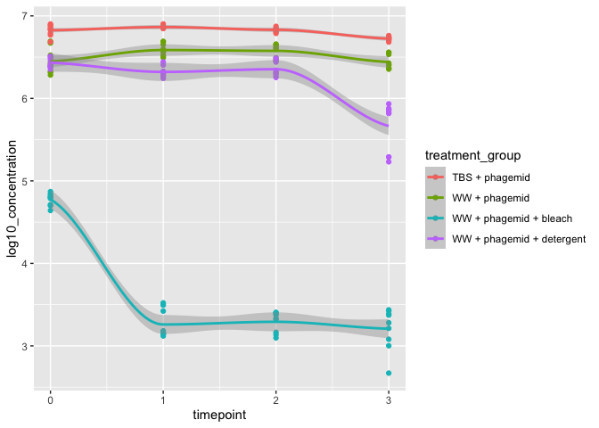

qPCR Analysis
================

``` r
library(tidyverse)
```

    ## ── Attaching packages ─────────────────────────────────────── tidyverse 1.3.2 ──
    ## ✔ ggplot2 3.4.0             ✔ purrr   0.9000.0.9000
    ## ✔ tibble  3.1.8             ✔ dplyr   1.0.10       
    ## ✔ tidyr   1.2.1.9001        ✔ stringr 1.5.0.9000   
    ## ✔ readr   2.1.3             ✔ forcats 0.5.2        
    ## ── Conflicts ────────────────────────────────────────── tidyverse_conflicts() ──
    ## ✖ dplyr::filter() masks stats::filter()
    ## ✖ dplyr::lag()    masks stats::lag()

``` r
library(readxl)
```

# Ingest data

The qPCR machine outputs its data in excel files. For this experiment,
we can find the files [in our lab google
drive](https://drive.google.com/drive/folders/1W7bcgLTdgLp2NX2_Yl3J17dTZ71Bi6Ib).
Eventually, we might want to automate access to the data, but for now,
we’ll manually download Plates 1, 2, and 3 excel files and save to the
`data/` directory.

## Read qPCR data from excel files

For each plate, we’ll read the “Results” sheet. The first 42 rows of the
sheet are metadata that we don’t need, so we’ll skip them.

``` r
read_qpcr_excel <- function(path) {
  read_excel(
    path = path,
    sheet = "Results",
    skip = 42
  )
}
```

TODO: keep track of plate names when merging.

``` r
data_dir <- "data/"
filename_pattern <- "Plate [0-9]+[.]xls"
data_raw <- list.files(
  data_dir,
  pattern = filename_pattern,
  full.names = TRUE
  ) |>
    map(read_qpcr_excel) |> 
    list_rbind()
glimpse(data_raw)
```

    ## Rows: 198
    ## Columns: 33
    ## $ Well                     <dbl> 1, 2, 3, 13, 14, 15, 25, 26, 27, 28, 29, 30, …
    ## $ `Well Position`          <chr> "A1", "A2", "A3", "B1", "B2", "B3", "C1", "C2…
    ## $ Omit                     <lgl> FALSE, FALSE, FALSE, FALSE, FALSE, FALSE, FAL…
    ## $ `Sample Name`            <chr> "Blank", "Blank", "Blank", "B1_NTC", "B1_NTC"…
    ## $ `Target Name`            <chr> "Blank", "Blank", "Blank", "Barcode_1_NTC", "…
    ## $ Task                     <chr> "UNKNOWN", "UNKNOWN", "UNKNOWN", "UNKNOWN", "…
    ## $ Reporter                 <chr> "FAM", "FAM", "FAM", "FAM", "FAM", "FAM", "FA…
    ## $ Quencher                 <chr> "NFQ-MGB", "NFQ-MGB", "NFQ-MGB", "NFQ-MGB", "…
    ## $ CT                       <chr> "Undetermined", "Undetermined", "Undetermined…
    ## $ `Ct Mean`                <dbl> NA, NA, NA, 36.35009, 36.35009, 36.35009, 20.…
    ## $ `Ct SD`                  <dbl> NA, NA, NA, 0.60550117, 0.60550117, 0.6055011…
    ## $ Quantity                 <lgl> NA, NA, NA, NA, NA, NA, NA, NA, NA, NA, NA, N…
    ## $ `Quantity Mean`          <lgl> NA, NA, NA, NA, NA, NA, NA, NA, NA, NA, NA, N…
    ## $ `Quantity SD`            <lgl> NA, NA, NA, NA, NA, NA, NA, NA, NA, NA, NA, N…
    ## $ `Y-Intercept`            <lgl> NA, NA, NA, NA, NA, NA, NA, NA, NA, NA, NA, N…
    ## $ `R(superscript 2)`       <lgl> NA, NA, NA, NA, NA, NA, NA, NA, NA, NA, NA, N…
    ## $ Slope                    <lgl> NA, NA, NA, NA, NA, NA, NA, NA, NA, NA, NA, N…
    ## $ Efficiency               <lgl> NA, NA, NA, NA, NA, NA, NA, NA, NA, NA, NA, N…
    ## $ `Automatic Ct Threshold` <lgl> FALSE, FALSE, FALSE, FALSE, FALSE, FALSE, FAL…
    ## $ `Ct Threshold`           <dbl> 0.2, 0.2, 0.2, 0.2, 0.2, 0.2, 0.2, 0.2, 0.2, …
    ## $ `Automatic Baseline`     <lgl> TRUE, TRUE, TRUE, TRUE, TRUE, TRUE, TRUE, TRU…
    ## $ `Baseline Start`         <dbl> 3, 3, 3, 3, 3, 3, 3, 3, 3, 3, 3, 3, 3, 3, 3, …
    ## $ `Baseline End`           <dbl> 15, 22, 39, 30, 39, 31, 16, 14, 13, 13, 14, 1…
    ## $ `Amp Status`             <chr> "No Amp", "No Amp", "Inconclusive", "Inconclu…
    ## $ Comments                 <lgl> NA, NA, NA, NA, NA, NA, NA, NA, NA, NA, NA, N…
    ## $ `Cq Conf`                <dbl> 0.0000000, 0.0000000, 0.0000000, 0.9320759, 0…
    ## $ `Target Color`           <chr> "RGB(0,139,69)", "RGB(0,139,69)", "RGB(0,139,…
    ## $ CQCONF                   <chr> "Y", "Y", "Y", "N", "Y", "N", "N", "N", "N", …
    ## $ EXPFAIL                  <chr> "N", "N", "Y", "N", "Y", "N", "N", "N", "N", …
    ## $ HIGHSD                   <chr> "N", "N", "N", "Y", "N", "Y", "N", "N", "N", …
    ## $ NOAMP                    <chr> "N", "N", "N", "N", "Y", "N", "N", "N", "N", …
    ## $ NOISE                    <chr> "N", "Y", "Y", "N", "N", "N", "N", "N", "N", …
    ## $ BADROX                   <chr> NA, NA, NA, NA, NA, NA, NA, NA, NA, NA, NA, N…

## Tidy the data

We’re only going to keep a subset of columns:

- `CT`: the Ct value. Either “Undetermined” or a number. We’ll use
  `as.numeric` to convert from a character string to a number (double).
- `Sample Name` labels the content of the samples
- `Well Position` is the alphanumeric plate well ID (e.g., “A01”). Note:
  this is redundant with `Sample Name` here, but in the future we may
  want to automatically label the samples from `Well Position` using a
  plate layout file.
- `Ct Threshold`. These should all be `0.2`. We will check that for
  quality control.
- `Automatic Ct Threshold`. These should all be `FALSE`
- `Target Name` can be used to distinguish experimental samples
  (“Barcode_1”) from blanks (“Blank”) and NTCs (“Barcode_1\_NTC”). We’ll
  encode these as factors because they have a limited set of values.

We’ll also rename the columns consistently in “snake case” (i.e., all
lowercase with underscores separating the words.)

``` r
data_extracted <- data_raw |>
  transmute(
    ct = as.numeric(CT),
    sample_name = `Sample Name`,
    well_position = `Well Position`,
    ct_threshold = `Ct Threshold`,
    auto_ct_threshold = `Automatic Ct Threshold`,
    target_name = as.factor(`Target Name`)
  )
```

    ## Warning in mask$eval_all_mutate(quo): NAs introduced by coercion

``` r
glimpse(data_extracted)
```

    ## Rows: 198
    ## Columns: 6
    ## $ ct                <dbl> NA, NA, NA, 35.92194, NA, 36.77825, 20.32065, 19.764…
    ## $ sample_name       <chr> "Blank", "Blank", "Blank", "B1_NTC", "B1_NTC", "B1_N…
    ## $ well_position     <chr> "A1", "A2", "A3", "B1", "B2", "B3", "C1", "C2", "C3"…
    ## $ ct_threshold      <dbl> 0.2, 0.2, 0.2, 0.2, 0.2, 0.2, 0.2, 0.2, 0.2, 0.2, 0.…
    ## $ auto_ct_threshold <lgl> FALSE, FALSE, FALSE, FALSE, FALSE, FALSE, FALSE, FAL…
    ## $ target_name       <fct> Blank, Blank, Blank, Barcode_1_NTC, Barcode_1_NTC, B…

Quality control. Check assertions about ct threshold and autothreshold

``` r
expected_ct_threshold <- 0.2
data_extracted |> 
  summarize(
    all_auto_ct_theshold_false = all(!auto_ct_threshold),
    all_ct_theshold_expected = all(ct_threshold == expected_ct_threshold)
  )
```

    ## # A tibble: 1 × 2
    ##   all_auto_ct_theshold_false all_ct_theshold_expected
    ##   <lgl>                      <lgl>                   
    ## 1 TRUE                       TRUE

TODO: It would be nice to specify what values to convert to `NA`
quietly. In the future we may want to redo the baseline subtraction
manually, but for now, we’ll ignore those columns.

Currently we have the `sample_name` column, which contains three pieces
of information: the experiment (e.g., “A”, “B”, …), the timepoint, and
the technical replicate number. To make the data tidier, we’ll split
this into separate columns.

We will use regular expressions to match the expected pattern, which is:

1.  The start of the string
2.  The treatment group, specified by one or more letters
3.  The timepoint, specified by one or more numbers
4.  A period
5.  The technical replicate, specified by one or more numbers
6.  The end of the string

In our input data, the non-template control was named “B1_NTC”, which
will break our naming scheme. We’ll rename it to “NTC” first.

TODO: Convert the treatment group letters to actual names

``` r
data_tidy <- data_extracted |> 
  mutate(
    sample_name = str_replace(sample_name, "B1_NTC", "NTC")
  ) |> 
  separate_wider_regex(
    sample_name,
    patterns = c(
      "^",
      treatment_group = "[A-Za-z]+",
      timepoint = "[0-9]+",
      "\\.",
      tech_rep = "[0-9]+",
      "$"
    ),
    too_few = "align_start"
  ) |> 
  mutate(
    treatment_group = as.factor(treatment_group),
    timepoint = as.integer(timepoint),
    tech_rep = as.factor(tech_rep)
  )
glimpse(data_tidy)
```

    ## Rows: 198
    ## Columns: 8
    ## $ ct                <dbl> NA, NA, NA, 35.92194, NA, 36.77825, 20.32065, 19.764…
    ## $ treatment_group   <fct> Blank, Blank, Blank, NTC, NTC, NTC, A, A, A, A, A, A…
    ## $ timepoint         <int> NA, NA, NA, NA, NA, NA, 0, 0, 0, 1, 1, 1, 2, 2, 2, 3…
    ## $ tech_rep          <fct> NA, NA, NA, NA, NA, NA, 1, 2, 3, 1, 2, 3, 1, 2, 3, 1…
    ## $ well_position     <chr> "A1", "A2", "A3", "B1", "B2", "B3", "C1", "C2", "C3"…
    ## $ ct_threshold      <dbl> 0.2, 0.2, 0.2, 0.2, 0.2, 0.2, 0.2, 0.2, 0.2, 0.2, 0.…
    ## $ auto_ct_threshold <lgl> FALSE, FALSE, FALSE, FALSE, FALSE, FALSE, FALSE, FAL…
    ## $ target_name       <fct> Blank, Blank, Blank, Barcode_1_NTC, Barcode_1_NTC, B…

``` r
data_tidy |>
  group_by(treatment_group) |>
  count()
```

    ## # A tibble: 7 × 2
    ## # Groups:   treatment_group [7]
    ##   treatment_group     n
    ##   <fct>           <int>
    ## 1 A                  36
    ## 2 B                  36
    ## 3 Blank               9
    ## 4 C                  36
    ## 5 D                  36
    ## 6 E                  36
    ## 7 NTC                 9

``` r
data_tidy |> 
  filter(treatment_group == "Blank" | treatment_group == "NTC")
```

    ## # A tibble: 18 × 8
    ##       ct treatment_group timepoint tech_rep well_posit…¹ ct_th…² auto_…³ targe…⁴
    ##    <dbl> <fct>               <int> <fct>    <chr>          <dbl> <lgl>   <fct>  
    ##  1 NA    Blank                  NA <NA>     A1               0.2 FALSE   Blank  
    ##  2 NA    Blank                  NA <NA>     A2               0.2 FALSE   Blank  
    ##  3 NA    Blank                  NA <NA>     A3               0.2 FALSE   Blank  
    ##  4 35.9  NTC                    NA <NA>     B1               0.2 FALSE   Barcod…
    ##  5 NA    NTC                    NA <NA>     B2               0.2 FALSE   Barcod…
    ##  6 36.8  NTC                    NA <NA>     B3               0.2 FALSE   Barcod…
    ##  7 33.5  Blank                  NA <NA>     A1               0.2 FALSE   Blank  
    ##  8 NA    Blank                  NA <NA>     A2               0.2 FALSE   Blank  
    ##  9  6.36 Blank                  NA <NA>     A3               0.2 FALSE   Blank  
    ## 10 NA    NTC                    NA <NA>     B1               0.2 FALSE   Barcod…
    ## 11 NA    NTC                    NA <NA>     B2               0.2 FALSE   Barcod…
    ## 12 NA    NTC                    NA <NA>     B3               0.2 FALSE   Barcod…
    ## 13 NA    Blank                  NA <NA>     A1               0.2 FALSE   Blank  
    ## 14 NA    Blank                  NA <NA>     A2               0.2 FALSE   Blank  
    ## 15 NA    Blank                  NA <NA>     A3               0.2 FALSE   Blank  
    ## 16 39.7  NTC                    NA <NA>     B1               0.2 FALSE   Barcod…
    ## 17 NA    NTC                    NA <NA>     B2               0.2 FALSE   Barcod…
    ## 18 37.3  NTC                    NA <NA>     B3               0.2 FALSE   Barcod…
    ## # … with abbreviated variable names ¹​well_position, ²​ct_threshold,
    ## #   ³​auto_ct_threshold, ⁴​target_name

``` r
ct_max <- max(data_tidy$ct, na.rm = TRUE) + 1
data_tidy |>
  mutate(ct = replace_na(ct, ct_max)) |>
  ggplot(mapping = aes(ct, treatment_group)) +
  geom_boxplot()
```

<!-- -->

# Convert raw Ct values to concentrations

From Ari’s Excel sheet, we have the following steps:

1.  Use the regression coefficients from the standard to convert Ct
    values to “dilution” (this is a linear relationship $c_t = a d + b$)
2.  Convert dilution to concentration (in copies per microliter) using
    $\text{concentration} = C e^{\log(f_d) d}$, where $f_d$ is the
    fold-dilution at each dilution. In this case, $f_d = 10$.

The variable $d$ labels the level of dilution where 9 is a 10x dilution
of the original sample, 8 is 10x of dilution 9, etc. By implication, the
coefficient $C$ is the expected concentration at dilution 0, i.e. the
original concentration times $10^{10}$.

Note that the coefficients $a$, $b$, and $C$, are phagemid-specific. The
first two are estimated from the standard curve. $C$ is known from the
experimental protocol. In the future we would like estimate these
concentrations directly in this workflow.

We need to specify these coefficients:

``` r
std_curve_slope <- -3.6855
std_curve_intercept <- 43.498
concentration_at_d0 <- 0.9871
dilution_factor <- 10
```

We’ll apply the two equations in separate steps so we can compare
intermediate values with Ari’s spreadsheet. Eventually, we’ll condense
this into one conversion.

``` r
treatments_to_keep <- c("A", "B", "C", "D")
data_concentration <- data_tidy |>
  filter(treatment_group %in% treatments_to_keep) |>
  mutate(
    dilution = (ct - std_curve_intercept) / std_curve_slope,
    log_concentration = log(concentration_at_d0) + log(dilution_factor) * dilution,
  )
glimpse(data_concentration)
```

    ## Rows: 144
    ## Columns: 10
    ## $ ct                <dbl> 20.32065, 19.76434, 18.81370, 18.81602, 19.44741, 19…
    ## $ treatment_group   <fct> A, A, A, A, A, A, A, A, A, A, A, A, A, A, A, A, A, A…
    ## $ timepoint         <int> 0, 0, 0, 1, 1, 1, 2, 2, 2, 3, 3, 3, 0, 0, 0, 1, 1, 1…
    ## $ tech_rep          <fct> 1, 2, 3, 1, 2, 3, 1, 2, 3, 1, 2, 3, 1, 2, 3, 1, 2, 3…
    ## $ well_position     <chr> "C1", "C2", "C3", "C4", "C5", "C6", "C7", "C8", "C9"…
    ## $ ct_threshold      <dbl> 0.2, 0.2, 0.2, 0.2, 0.2, 0.2, 0.2, 0.2, 0.2, 0.2, 0.…
    ## $ auto_ct_threshold <lgl> FALSE, FALSE, FALSE, FALSE, FALSE, FALSE, FALSE, FAL…
    ## $ target_name       <fct> Barcode_1, Barcode_1, Barcode_1, Barcode_1, Barcode_…
    ## $ dilution          <dbl> 6.288793, 6.439739, 6.697681, 6.697049, 6.525733, 6.…
    ## $ log_concentration <dbl> 14.46750, 14.81506, 15.40900, 15.40754, 15.01307, 14…

``` r
data_concentration |>
  group_by(treatment_group, timepoint, tech_rep) |>
  summarize(
    conc_min = min(log_concentration, na.rm = TRUE),
    conc_med = median(log_concentration, na.rm = TRUE),
    conc_max = max(log_concentration, na.rm = TRUE)
  )
```

    ## `summarise()` has grouped output by 'treatment_group', 'timepoint'. You can
    ## override using the `.groups` argument.

    ## # A tibble: 48 × 6
    ## # Groups:   treatment_group, timepoint [16]
    ##    treatment_group timepoint tech_rep conc_min conc_med conc_max
    ##    <fct>               <int> <fct>       <dbl>    <dbl>    <dbl>
    ##  1 A                       0 1            14.5     14.5     14.6
    ##  2 A                       0 2            14.7     14.8     14.8
    ##  3 A                       0 3            15.0     15.4     15.4
    ##  4 A                       1 1            15.3     15.4     15.4
    ##  5 A                       1 2            15.0     15.1     15.2
    ##  6 A                       1 3            15.0     15.0     15.1
    ##  7 A                       2 1            15.2     15.2     15.3
    ##  8 A                       2 2            15.2     15.3     15.3
    ##  9 A                       2 3            14.9     14.9     14.9
    ## 10 A                       3 1            14.6     14.7     14.7
    ## # … with 38 more rows

# Plot log concentrations vs time for each condition

``` r
data_concentration |> 
  ggplot(
    aes(timepoint, log_concentration, shape = treatment_group, color = treatment_group)
    ) +
  geom_jitter(
    height = 0,
    width = 0.1
  )
```

<!-- -->

Let’s look at within- vs between-technical replicate variation:

``` r
data_concentration |>
  ggplot(aes(timepoint,log_concentration, group = tech_rep)) +
  stat_summary(
    fun.min = min,
    fun.max = max,
    fun = median,
    position = position_dodge(width = 0.2),
    size = 0.2
    ) +
  facet_wrap(
    facets = ~ treatment_group,
    )
```

<!-- -->

``` r
data_concentration |>
  ggplot(aes(timepoint,log_concentration, group = tech_rep)) +
  stat_summary(
    fun.min = min,
    fun.max = max,
    fun = median,
    position = position_dodge(width = 0.2),
    size = 0.2
    ) +
  facet_wrap(
    facets = ~ treatment_group,
    scales = "free_y"
    )
```

<!-- -->

``` r
data_concentration |>
  ggplot(aes(timepoint, log_concentration, color=treatment_group)) +
  geom_point() +
  geom_smooth()
```

    ## `geom_smooth()` using method = 'loess' and formula = 'y ~ x'

    ## Warning in simpleLoess(y, x, w, span, degree = degree, parametric =
    ## parametric, : pseudoinverse used at -0.015

    ## Warning in simpleLoess(y, x, w, span, degree = degree, parametric =
    ## parametric, : neighborhood radius 2.015

    ## Warning in simpleLoess(y, x, w, span, degree = degree, parametric =
    ## parametric, : reciprocal condition number 1.4891e-16

    ## Warning in simpleLoess(y, x, w, span, degree = degree, parametric =
    ## parametric, : There are other near singularities as well. 4.0602

    ## Warning in predLoess(object$y, object$x, newx = if
    ## (is.null(newdata)) object$x else if (is.data.frame(newdata))
    ## as.matrix(model.frame(delete.response(terms(object)), : pseudoinverse used at
    ## -0.015

    ## Warning in predLoess(object$y, object$x, newx = if
    ## (is.null(newdata)) object$x else if (is.data.frame(newdata))
    ## as.matrix(model.frame(delete.response(terms(object)), : neighborhood radius
    ## 2.015

    ## Warning in predLoess(object$y, object$x, newx = if
    ## (is.null(newdata)) object$x else if (is.data.frame(newdata))
    ## as.matrix(model.frame(delete.response(terms(object)), : reciprocal condition
    ## number 1.4891e-16

    ## Warning in predLoess(object$y, object$x, newx = if
    ## (is.null(newdata)) object$x else if (is.data.frame(newdata))
    ## as.matrix(model.frame(delete.response(terms(object)), : There are other near
    ## singularities as well. 4.0602

    ## Warning in simpleLoess(y, x, w, span, degree = degree, parametric =
    ## parametric, : pseudoinverse used at -0.015

    ## Warning in simpleLoess(y, x, w, span, degree = degree, parametric =
    ## parametric, : neighborhood radius 2.015

    ## Warning in simpleLoess(y, x, w, span, degree = degree, parametric =
    ## parametric, : reciprocal condition number 1.4891e-16

    ## Warning in simpleLoess(y, x, w, span, degree = degree, parametric =
    ## parametric, : There are other near singularities as well. 4.0602

    ## Warning in predLoess(object$y, object$x, newx = if
    ## (is.null(newdata)) object$x else if (is.data.frame(newdata))
    ## as.matrix(model.frame(delete.response(terms(object)), : pseudoinverse used at
    ## -0.015

    ## Warning in predLoess(object$y, object$x, newx = if
    ## (is.null(newdata)) object$x else if (is.data.frame(newdata))
    ## as.matrix(model.frame(delete.response(terms(object)), : neighborhood radius
    ## 2.015

    ## Warning in predLoess(object$y, object$x, newx = if
    ## (is.null(newdata)) object$x else if (is.data.frame(newdata))
    ## as.matrix(model.frame(delete.response(terms(object)), : reciprocal condition
    ## number 1.4891e-16

    ## Warning in predLoess(object$y, object$x, newx = if
    ## (is.null(newdata)) object$x else if (is.data.frame(newdata))
    ## as.matrix(model.frame(delete.response(terms(object)), : There are other near
    ## singularities as well. 4.0602

    ## Warning in simpleLoess(y, x, w, span, degree = degree, parametric =
    ## parametric, : pseudoinverse used at -0.015

    ## Warning in simpleLoess(y, x, w, span, degree = degree, parametric =
    ## parametric, : neighborhood radius 2.015

    ## Warning in simpleLoess(y, x, w, span, degree = degree, parametric =
    ## parametric, : reciprocal condition number 1.4891e-16

    ## Warning in simpleLoess(y, x, w, span, degree = degree, parametric =
    ## parametric, : There are other near singularities as well. 4.0602

    ## Warning in predLoess(object$y, object$x, newx = if
    ## (is.null(newdata)) object$x else if (is.data.frame(newdata))
    ## as.matrix(model.frame(delete.response(terms(object)), : pseudoinverse used at
    ## -0.015

    ## Warning in predLoess(object$y, object$x, newx = if
    ## (is.null(newdata)) object$x else if (is.data.frame(newdata))
    ## as.matrix(model.frame(delete.response(terms(object)), : neighborhood radius
    ## 2.015

    ## Warning in predLoess(object$y, object$x, newx = if
    ## (is.null(newdata)) object$x else if (is.data.frame(newdata))
    ## as.matrix(model.frame(delete.response(terms(object)), : reciprocal condition
    ## number 1.4891e-16

    ## Warning in predLoess(object$y, object$x, newx = if
    ## (is.null(newdata)) object$x else if (is.data.frame(newdata))
    ## as.matrix(model.frame(delete.response(terms(object)), : There are other near
    ## singularities as well. 4.0602

    ## Warning in simpleLoess(y, x, w, span, degree = degree, parametric =
    ## parametric, : pseudoinverse used at -0.015

    ## Warning in simpleLoess(y, x, w, span, degree = degree, parametric =
    ## parametric, : neighborhood radius 2.015

    ## Warning in simpleLoess(y, x, w, span, degree = degree, parametric =
    ## parametric, : reciprocal condition number 1.4891e-16

    ## Warning in simpleLoess(y, x, w, span, degree = degree, parametric =
    ## parametric, : There are other near singularities as well. 4.0602

    ## Warning in predLoess(object$y, object$x, newx = if
    ## (is.null(newdata)) object$x else if (is.data.frame(newdata))
    ## as.matrix(model.frame(delete.response(terms(object)), : pseudoinverse used at
    ## -0.015

    ## Warning in predLoess(object$y, object$x, newx = if
    ## (is.null(newdata)) object$x else if (is.data.frame(newdata))
    ## as.matrix(model.frame(delete.response(terms(object)), : neighborhood radius
    ## 2.015

    ## Warning in predLoess(object$y, object$x, newx = if
    ## (is.null(newdata)) object$x else if (is.data.frame(newdata))
    ## as.matrix(model.frame(delete.response(terms(object)), : reciprocal condition
    ## number 1.4891e-16

    ## Warning in predLoess(object$y, object$x, newx = if
    ## (is.null(newdata)) object$x else if (is.data.frame(newdata))
    ## as.matrix(model.frame(delete.response(terms(object)), : There are other near
    ## singularities as well. 4.0602

<!-- -->

``` r
data_concentration |>
  ggplot(aes(timepoint, log_concentration, color=treatment_group)) +
  geom_point() +
  geom_smooth(
    method = "lm"
  )
```

    ## `geom_smooth()` using formula = 'y ~ x'

<!-- -->

# TODO

- Analysis of variance (between and within technical replicates,
  heteroskedacity)
- Model fits
