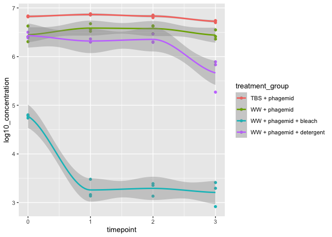
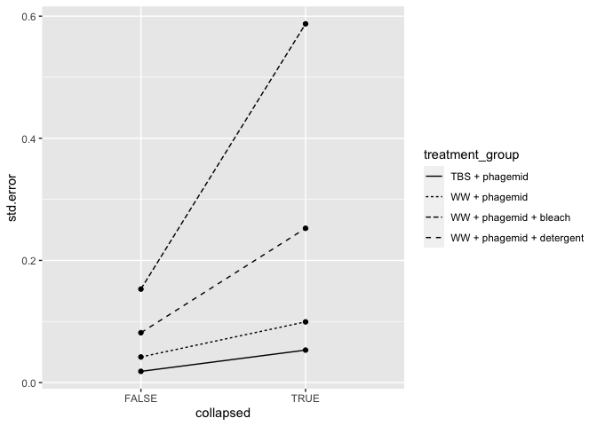

qPCR Analysis
================

``` r
library(tidyverse)
```

    ## ── Attaching packages ─────────────────────────────────────── tidyverse 1.3.2 ──
    ## ✔ ggplot2 3.4.0             ✔ purrr   0.9000.0.9000
    ## ✔ tibble  3.1.8             ✔ dplyr   1.0.10       
    ## ✔ tidyr   1.2.1.9001        ✔ stringr 1.5.0.9000   
    ## ✔ readr   2.1.3             ✔ forcats 0.5.2        
    ## ── Conflicts ────────────────────────────────────────── tidyverse_conflicts() ──
    ## ✖ dplyr::filter() masks stats::filter()
    ## ✖ dplyr::lag()    masks stats::lag()

``` r
library(readxl)
library(broom)
library(knitr)
```

# Ingest data

The qPCR machine outputs its data in excel files. For this experiment,
we can find the files [in our lab google
drive](https://drive.google.com/drive/folders/1W7bcgLTdgLp2NX2_Yl3J17dTZ71Bi6Ib).
Eventually, we might want to automate access to the data, but for now,
we’ll manually download Plates 1, 2, and 3 excel files and save to the
`data/` directory.

## Read qPCR data from excel files

For each plate, we’ll read the “Results” sheet. The first 42 rows of the
sheet are metadata that we don’t need, so we’ll skip them. We’ll also
save the path in a column called “source” so we can look for plate
effects if we’d like after we merge files.

``` r
read_qpcr_excel <- function(path) {
  read_excel(
    path = path,
    sheet = "Results",
    skip = 42
  ) |>
    mutate(source = path)
}
```

``` r
data_dir <- "data/"
filename_pattern <- "Plate [0-9]+[.]xls"
data_raw <- list.files(
  data_dir,
  pattern = filename_pattern,
  full.names = TRUE
  ) |>
  map(read_qpcr_excel) |> 
  list_rbind()
kable(head(data_raw, n = 10))
```

| Well | Well Position | Omit  | Sample Name | Target Name    | Task    | Reporter | Quencher | CT                 |  Ct Mean |     Ct SD | Quantity | Quantity Mean | Quantity SD | Y-Intercept | R(superscript 2) | Slope | Efficiency | Automatic Ct Threshold | Ct Threshold | Automatic Baseline | Baseline Start | Baseline End | Amp Status   | Comments |   Cq Conf | Target Color   | CQCONF | EXPFAIL | HIGHSD | NOAMP | NOISE | source            | BADROX |
|-----:|:--------------|:------|:------------|:---------------|:--------|:---------|:---------|:-------------------|---------:|----------:|:---------|:--------------|:------------|:------------|:-----------------|:------|:-----------|:-----------------------|-------------:|:-------------------|---------------:|-------------:|:-------------|:---------|----------:|:---------------|:-------|:--------|:-------|:------|:------|:------------------|:-------|
|    1 | A1            | FALSE | Blank       | Blank          | UNKNOWN | FAM      | NFQ-MGB  | Undetermined       |       NA |        NA | NA       | NA            | NA          | NA          | NA               | NA    | NA         | FALSE                  |          0.2 | TRUE               |              3 |           15 | No Amp       | NA       | 0.0000000 | RGB(0,139,69)  | Y      | N       | N      | N     | N     | data//Plate 1.xls | NA     |
|    2 | A2            | FALSE | Blank       | Blank          | UNKNOWN | FAM      | NFQ-MGB  | Undetermined       |       NA |        NA | NA       | NA            | NA          | NA          | NA               | NA    | NA         | FALSE                  |          0.2 | TRUE               |              3 |           22 | No Amp       | NA       | 0.0000000 | RGB(0,139,69)  | Y      | N       | N      | N     | Y     | data//Plate 1.xls | NA     |
|    3 | A3            | FALSE | Blank       | Blank          | UNKNOWN | FAM      | NFQ-MGB  | Undetermined       |       NA |        NA | NA       | NA            | NA          | NA          | NA               | NA    | NA         | FALSE                  |          0.2 | TRUE               |              3 |           39 | Inconclusive | NA       | 0.0000000 | RGB(0,139,69)  | Y      | Y       | N      | N     | Y     | data//Plate 1.xls | NA     |
|   13 | B1            | FALSE | B1_NTC      | Barcode_1\_NTC | UNKNOWN | FAM      | NFQ-MGB  | 35.921939849853516 | 36.35009 | 0.6055012 | NA       | NA            | NA          | NA          | NA               | NA    | NA         | FALSE                  |          0.2 | TRUE               |              3 |           30 | Inconclusive | NA       | 0.9320759 | RGB(0,139,69)  | N      | N       | Y      | N     | N     | data//Plate 1.xls | NA     |
|   14 | B2            | FALSE | B1_NTC      | Barcode_1\_NTC | UNKNOWN | FAM      | NFQ-MGB  | Undetermined       | 36.35009 | 0.6055012 | NA       | NA            | NA          | NA          | NA               | NA    | NA         | FALSE                  |          0.2 | TRUE               |              3 |           39 | No Amp       | NA       | 0.0000000 | RGB(0,139,69)  | Y      | Y       | N      | Y     | N     | data//Plate 1.xls | NA     |
|   15 | B3            | FALSE | B1_NTC      | Barcode_1\_NTC | UNKNOWN | FAM      | NFQ-MGB  | 36.778247833251953 | 36.35009 | 0.6055012 | NA       | NA            | NA          | NA          | NA               | NA    | NA         | FALSE                  |          0.2 | TRUE               |              3 |           31 | Inconclusive | NA       | 0.9147403 | RGB(0,139,69)  | N      | N       | Y      | N     | N     | data//Plate 1.xls | NA     |
|   25 | C1            | FALSE | A0.1        | Barcode_1      | UNKNOWN | FAM      | NFQ-MGB  | 20.320652008056641 | 20.23325 | 0.0774648 | NA       | NA            | NA          | NA          | NA               | NA    | NA         | FALSE                  |          0.2 | TRUE               |              3 |           16 | Amp          | NA       | 0.9699352 | RGB(176,23,31) | N      | N       | N      | N     | N     | data//Plate 1.xls | NA     |
|   26 | C2            | FALSE | A0.2        | Barcode_1      | UNKNOWN | FAM      | NFQ-MGB  | 19.764341354370117 | 19.85664 | 0.0884714 | NA       | NA            | NA          | NA          | NA               | NA    | NA         | FALSE                  |          0.2 | TRUE               |              3 |           14 | Amp          | NA       | 0.9626578 | RGB(176,23,31) | N      | N       | N      | N     | N     | data//Plate 1.xls | NA     |
|   27 | C3            | FALSE | A0.3        | Barcode_1      | UNKNOWN | FAM      | NFQ-MGB  | 18.813695907592773 | 19.04667 | 0.3385253 | NA       | NA            | NA          | NA          | NA               | NA    | NA         | FALSE                  |          0.2 | TRUE               |              3 |           13 | Amp          | NA       | 0.9706940 | RGB(176,23,31) | N      | N       | N      | N     | N     | data//Plate 1.xls | NA     |
|   28 | C4            | FALSE | A1.1        | Barcode_1      | UNKNOWN | FAM      | NFQ-MGB  | 18.816024780273438 | 18.87321 | 0.0788805 | NA       | NA            | NA          | NA          | NA               | NA    | NA         | FALSE                  |          0.2 | TRUE               |              3 |           13 | Amp          | NA       | 0.9645014 | RGB(176,23,31) | N      | N       | N      | N     | N     | data//Plate 1.xls | NA     |

## Tidy the data

We’re only going to keep a subset of columns. In the next block we
extract the columns we want and convert them to the correct datatypes.

- `CT`: the Ct value. Either “Undetermined” or a number. We’ll use
  `as.numeric` to convert from a character string to a number (double).
- `Sample Name` labels the content of the samples
- `Well Position` is the alphanumeric plate well ID (e.g., “A01”). Note:
  this is redundant with `Sample Name` here, but in the future we may
  want to automatically label the samples from `Well Position` using a
  plate layout file.
- `Ct Threshold`. These should all be `0.2`. We will check that for
  quality control.
- `Automatic Ct Threshold`. These should all be `FALSE`
- `Target Name` can be used to distinguish experimental samples
  (“Barcode_1”) from blanks (“Blank”) and NTCs (“Barcode_1\_NTC”). We’ll
  encode these as factors because they have a limited set of values.

We’ll also rename the columns consistently in “snake case” (i.e., all
lowercase with underscores separating the words.)

In the future we may want to redo the baseline subtraction manually, but
for now, we’ll ignore those columns.

``` r
data_extracted <- data_raw |>
  transmute(
    ct = as.numeric(CT),
    sample_name = `Sample Name`,
    well_position = `Well Position`,
    ct_threshold = `Ct Threshold`,
    auto_ct_threshold = `Automatic Ct Threshold`,
    target_name = as.factor(`Target Name`)
  )
```

    ## Warning in mask$eval_all_mutate(quo): NAs introduced by coercion

``` r
kable(head(data_extracted, n = 10))
```

|       ct | sample_name | well_position | ct_threshold | auto_ct_threshold | target_name    |
|---------:|:------------|:--------------|-------------:|:------------------|:---------------|
|       NA | Blank       | A1            |          0.2 | FALSE             | Blank          |
|       NA | Blank       | A2            |          0.2 | FALSE             | Blank          |
|       NA | Blank       | A3            |          0.2 | FALSE             | Blank          |
| 35.92194 | B1_NTC      | B1            |          0.2 | FALSE             | Barcode_1\_NTC |
|       NA | B1_NTC      | B2            |          0.2 | FALSE             | Barcode_1\_NTC |
| 36.77825 | B1_NTC      | B3            |          0.2 | FALSE             | Barcode_1\_NTC |
| 20.32065 | A0.1        | C1            |          0.2 | FALSE             | Barcode_1      |
| 19.76434 | A0.2        | C2            |          0.2 | FALSE             | Barcode_1      |
| 18.81370 | A0.3        | C3            |          0.2 | FALSE             | Barcode_1      |
| 18.81602 | A1.1        | C4            |          0.2 | FALSE             | Barcode_1      |

TODO: It would be nice to specify what values to convert to `NA`
quietly.

For quality control, let’s check assertions our assertions about about
`ct_threshold` and `autothreshold`.

``` r
expected_ct_threshold <- 0.2
data_extracted |> 
  summarize(
    all_auto_ct_theshold_false = all(!auto_ct_threshold),
    all_ct_theshold_expected = all(ct_threshold == expected_ct_threshold)
  )
```

    ## # A tibble: 1 × 2
    ##   all_auto_ct_theshold_false all_ct_theshold_expected
    ##   <lgl>                      <lgl>                   
    ## 1 TRUE                       TRUE

Currently we have the `sample_name` column, which contains three pieces
of information: the experiment (e.g., “A”, “B”, …), the timepoint, and
the technical replicate number. To make the data tidier, we’ll split
this into separate columns.

We will use regular expressions to match the expected pattern, which is:

1.  The start of the string
2.  The treatment group, specified by one or more letters
3.  The timepoint, specified by one or more numbers
4.  A period
5.  The technical replicate, specified by one or more numbers
6.  The end of the string

In our input data, the non-template control was named “B1_NTC”, which
will break our naming scheme. We’ll rename it to “NTC” first.

TODO: Convert the treatment group letters to actual names

``` r
data_tidy <- data_extracted |> 
  mutate(
    sample_name = str_replace(sample_name, "B1_NTC", "NTC")
  ) |> 
  separate_wider_regex(
    sample_name,
    patterns = c(
      "^",
      treatment_group = "[A-Za-z]+",
      timepoint = "[0-9]+",
      "\\.",
      tech_rep = "[0-9]+",
      "$"
    ),
    too_few = "align_start"
  ) |> 
  mutate(
    treatment_group = as.factor(treatment_group),
    timepoint = as.integer(timepoint),
    tech_rep = as.factor(tech_rep)
  )
kable(head(data_tidy, n = 10))
```

|       ct | treatment_group | timepoint | tech_rep | well_position | ct_threshold | auto_ct_threshold | target_name    |
|---------:|:----------------|----------:|:---------|:--------------|-------------:|:------------------|:---------------|
|       NA | Blank           |        NA | NA       | A1            |          0.2 | FALSE             | Blank          |
|       NA | Blank           |        NA | NA       | A2            |          0.2 | FALSE             | Blank          |
|       NA | Blank           |        NA | NA       | A3            |          0.2 | FALSE             | Blank          |
| 35.92194 | NTC             |        NA | NA       | B1            |          0.2 | FALSE             | Barcode_1\_NTC |
|       NA | NTC             |        NA | NA       | B2            |          0.2 | FALSE             | Barcode_1\_NTC |
| 36.77825 | NTC             |        NA | NA       | B3            |          0.2 | FALSE             | Barcode_1\_NTC |
| 20.32065 | A               |         0 | 1        | C1            |          0.2 | FALSE             | Barcode_1      |
| 19.76434 | A               |         0 | 2        | C2            |          0.2 | FALSE             | Barcode_1      |
| 18.81370 | A               |         0 | 3        | C3            |          0.2 | FALSE             | Barcode_1      |
| 18.81602 | A               |         1 | 1        | C4            |          0.2 | FALSE             | Barcode_1      |

Let’s make sure we have 9 blanks and NTCs (3 per plate) and 36 of the
other treatments (3 pcr replicates \* 3 technical replicates \* 4
timepoints).

``` r
data_tidy |>
  group_by(treatment_group) |>
  count() |> 
  kable()
```

| treatment_group |   n |
|:----------------|----:|
| A               |  36 |
| B               |  36 |
| Blank           |   9 |
| C               |  36 |
| D               |  36 |
| E               |  36 |
| NTC             |   9 |

First, let’s take a look at the Blanks and NTCs. These should mostly
have `NA` for their ct value.

``` r
data_tidy |> 
  filter(treatment_group == "Blank" | treatment_group == "NTC") |> 
  kable()
```

|        ct | treatment_group | timepoint | tech_rep | well_position | ct_threshold | auto_ct_threshold | target_name    |
|----------:|:----------------|----------:|:---------|:--------------|-------------:|:------------------|:---------------|
|        NA | Blank           |        NA | NA       | A1            |          0.2 | FALSE             | Blank          |
|        NA | Blank           |        NA | NA       | A2            |          0.2 | FALSE             | Blank          |
|        NA | Blank           |        NA | NA       | A3            |          0.2 | FALSE             | Blank          |
| 35.921940 | NTC             |        NA | NA       | B1            |          0.2 | FALSE             | Barcode_1\_NTC |
|        NA | NTC             |        NA | NA       | B2            |          0.2 | FALSE             | Barcode_1\_NTC |
| 36.778248 | NTC             |        NA | NA       | B3            |          0.2 | FALSE             | Barcode_1\_NTC |
| 33.499622 | Blank           |        NA | NA       | A1            |          0.2 | FALSE             | Blank          |
|        NA | Blank           |        NA | NA       | A2            |          0.2 | FALSE             | Blank          |
|  6.357395 | Blank           |        NA | NA       | A3            |          0.2 | FALSE             | Blank          |
|        NA | NTC             |        NA | NA       | B1            |          0.2 | FALSE             | Barcode_1\_NTC |
|        NA | NTC             |        NA | NA       | B2            |          0.2 | FALSE             | Barcode_1\_NTC |
|        NA | NTC             |        NA | NA       | B3            |          0.2 | FALSE             | Barcode_1\_NTC |
|        NA | Blank           |        NA | NA       | A1            |          0.2 | FALSE             | Blank          |
|        NA | Blank           |        NA | NA       | A2            |          0.2 | FALSE             | Blank          |
|        NA | Blank           |        NA | NA       | A3            |          0.2 | FALSE             | Blank          |
| 39.660065 | NTC             |        NA | NA       | B1            |          0.2 | FALSE             | Barcode_1\_NTC |
|        NA | NTC             |        NA | NA       | B2            |          0.2 | FALSE             | Barcode_1\_NTC |
| 37.288032 | NTC             |        NA | NA       | B3            |          0.2 | FALSE             | Barcode_1\_NTC |

We can make a boxplot to compare the distribution of ct across
treatments. To disply the NAs, we’ll set them to one more than the
maximum possible values. We see that the Blanks, NTCs, and treatment E
(which is some sort of negative control?) have CT \> 35, with a few
outliers. We’ll probably want to check those at some point.

``` r
ct_max <- max(data_tidy$ct, na.rm = TRUE) + 1
data_tidy |>
  mutate(ct = replace_na(ct, ct_max)) |>
  ggplot(mapping = aes(ct, treatment_group)) +
  geom_boxplot()
```

<!-- -->

# Convert raw Ct values to concentrations

From Ari’s Excel sheet, we have the following steps:

1.  Use the regression coefficients from the standard to convert Ct
    values to “dilution” (this is a linear relationship $c_t = a d + b$)
2.  Convert dilution to concentration (in copies per microliter) using
    $\text{concentration} = C e^{\log(f_d) d}$, where $f_d$ is the
    fold-dilution at each dilution. In this case, $f_d = 10$.

The variable $d$ labels the level of dilution where 9 is a 10x dilution
of the original sample, 8 is 10x of dilution 9, etc. By implication, the
coefficient $C$ is the expected concentration at dilution 0, i.e. the
original concentration times $10^{10}$.

Note that the coefficients $a$, $b$, and $C$, are phagemid-specific. The
first two are estimated from the standard curve. $C$ is known from the
experimental protocol. In the future we would like estimate these
concentrations directly in this workflow.

We need to specify these coefficients:

``` r
std_curve_slope <- -3.6855
std_curve_intercept <- 43.498
concentration_at_d0 <- 0.9871
dilution_factor <- 10
```

We’ll apply the two equations in separate steps so we can compare
intermediate values with Ari’s spreadsheet. Eventually, we’ll condense
this into one conversion.

We’re also going to filter out the negative controls from now on.

``` r
treatments_to_keep <- c("A", "B", "C", "D")
data_concentration <- data_tidy |>
  filter(treatment_group %in% treatments_to_keep) |>
  mutate(
    dilution = (ct - std_curve_intercept) / std_curve_slope,
    log_concentration = log(concentration_at_d0) + log(dilution_factor) * dilution,
  )
kable(head(data_concentration, n = 10))
```

|       ct | treatment_group | timepoint | tech_rep | well_position | ct_threshold | auto_ct_threshold | target_name | dilution | log_concentration |
|---------:|:----------------|----------:|:---------|:--------------|-------------:|:------------------|:------------|---------:|------------------:|
| 20.32065 | A               |         0 | 1        | C1            |          0.2 | FALSE             | Barcode_1   | 6.288793 |          14.46750 |
| 19.76434 | A               |         0 | 2        | C2            |          0.2 | FALSE             | Barcode_1   | 6.439739 |          14.81506 |
| 18.81370 | A               |         0 | 3        | C3            |          0.2 | FALSE             | Barcode_1   | 6.697681 |          15.40900 |
| 18.81602 | A               |         1 | 1        | C4            |          0.2 | FALSE             | Barcode_1   | 6.697049 |          15.40754 |
| 19.44741 | A               |         1 | 2        | C5            |          0.2 | FALSE             | Barcode_1   | 6.525733 |          15.01307 |
| 19.54228 | A               |         1 | 3        | C6            |          0.2 | FALSE             | Barcode_1   | 6.499993 |          14.95380 |
| 18.98299 | A               |         2 | 1        | C7            |          0.2 | FALSE             | Barcode_1   | 6.651747 |          15.30323 |
| 18.98078 | A               |         2 | 2        | C8            |          0.2 | FALSE             | Barcode_1   | 6.652345 |          15.30461 |
| 19.66541 | A               |         2 | 3        | C9            |          0.2 | FALSE             | Barcode_1   | 6.466582 |          14.87687 |
| 20.02242 | A               |         3 | 1        | C10           |          0.2 | FALSE             | Barcode_1   | 6.369714 |          14.65382 |

Since we have three PCR replicates per technical replicate, we can
summarize our data with min, median, and max without any loss of
information.

``` r
data_concentration |>
  group_by(treatment_group, timepoint, tech_rep) |>
  summarize(
    conc_min = min(log_concentration, na.rm = TRUE),
    conc_med = median(log_concentration, na.rm = TRUE),
    conc_max = max(log_concentration, na.rm = TRUE),
    .groups="drop"
  ) |> 
  kable()
```

| treatment_group | timepoint | tech_rep |  conc_min |  conc_med |  conc_max |
|:----------------|----------:|:---------|----------:|----------:|----------:|
| A               |         0 | 1        | 14.467498 | 14.539121 | 14.559697 |
| A               |         0 | 2        | 14.704875 | 14.752250 | 14.815063 |
| A               |         0 | 3        | 15.020836 | 15.360500 | 15.408997 |
| A               |         1 | 1        | 15.315593 | 15.392311 | 15.407542 |
| A               |         1 | 2        | 15.013071 | 15.123416 | 15.193376 |
| A               |         1 | 3        | 14.953803 | 14.979106 | 15.100242 |
| A               |         2 | 1        | 15.222434 | 15.233419 | 15.303230 |
| A               |         2 | 2        | 15.183994 | 15.304607 | 15.330360 |
| A               |         2 | 3        | 14.873419 | 14.876872 | 14.948056 |
| A               |         3 | 1        | 14.631852 | 14.651272 | 14.653825 |
| A               |         3 | 2        | 14.742572 | 14.751832 | 14.800324 |
| A               |         3 | 3        | 15.042985 | 15.098861 | 15.100316 |
| B               |         0 | 1        | 14.691215 | 14.707181 | 14.723714 |
| B               |         0 | 2        | 14.937496 | 14.981082 | 14.986873 |
| B               |         0 | 3        | 14.630075 | 14.772313 | 14.884848 |
| B               |         1 | 1        | 14.460672 | 14.507884 | 14.530743 |
| B               |         1 | 2        | 14.431200 | 14.524827 | 14.569874 |
| B               |         1 | 3        | 14.375207 | 14.747474 | 14.834689 |
| B               |         2 | 1        | 14.445850 | 14.506649 | 14.514520 |
| B               |         2 | 2        | 14.399098 | 14.540501 | 14.597506 |
| B               |         2 | 3        | 14.829546 | 14.885799 | 14.944224 |
| B               |         3 | 1        | 13.393890 | 13.420946 | 13.479134 |
| B               |         3 | 2        | 13.508365 | 13.536396 | 13.662985 |
| B               |         3 | 3        | 12.045272 | 12.175395 | 12.181063 |
| C               |         0 | 1        | 15.585203 | 15.730980 | 15.774331 |
| C               |         0 | 2        | 15.640385 | 15.744967 | 15.827471 |
| C               |         0 | 3        | 15.392854 | 15.860508 | 15.891046 |
| C               |         1 | 1        | 15.766611 | 15.774405 | 15.815867 |
| C               |         1 | 2        | 15.799626 | 15.835428 | 15.892060 |
| C               |         1 | 3        | 15.766942 | 15.780796 | 15.817647 |
| C               |         2 | 1        | 15.630437 | 15.666167 | 15.683122 |
| C               |         2 | 2        | 15.748995 | 15.762468 | 15.825183 |
| C               |         2 | 3        | 15.745316 | 15.745680 | 15.763973 |
| C               |         3 | 1        | 15.471512 | 15.509831 | 15.526576 |
| C               |         3 | 2        | 15.490110 | 15.504371 | 15.567375 |
| C               |         3 | 3        | 15.388014 | 15.439595 | 15.448920 |
| D               |         0 | 1        | 11.023879 | 11.052359 | 11.103619 |
| D               |         0 | 2        | 10.819916 | 10.849192 | 11.061266 |
| D               |         0 | 3        | 10.687431 | 11.142662 | 11.213070 |
| D               |         1 | 1        |  7.185397 |  7.231021 |  7.245195 |
| D               |         1 | 2        |  7.247885 |  7.276237 |  7.328588 |
| D               |         1 | 3        |  7.880027 |  8.045826 |  8.107687 |
| D               |         2 | 1        |  7.131532 |  7.219262 |  7.287010 |
| D               |         2 | 2        |  7.770489 |  7.813055 |  7.832202 |
| D               |         2 | 3        |  7.650187 |  7.672781 |  7.842286 |
| D               |         3 | 1        |  7.398282 |  7.554920 |  7.801422 |
| D               |         3 | 2        |  6.148432 |  6.912249 |  7.093166 |
| D               |         3 | 3        |  7.767307 |  7.889023 |  7.912897 |

# Plot log concentrations vs time for each condition

First, we plot all the treatment groups on the same timecourse to see
differences in absolute as well as relative concentration.

``` r
data_concentration |> 
  ggplot(
    aes(timepoint, log_concentration, shape = treatment_group, color = treatment_group)
    ) +
  geom_jitter(
    height = 0,
    width = 0.1
  )
```

<!-- -->

Let’s look at within- vs between-technical replicate variation:

``` r
data_concentration |>
  ggplot(aes(timepoint,log_concentration, group = tech_rep)) +
  stat_summary(
    fun.min = min,
    fun.max = max,
    fun = median,
    position = position_dodge(width = 0.2),
    size = 0.2
    ) +
  facet_wrap(
    facets = ~ treatment_group,
    )
```

<!-- -->

The variation between treatments is swamping the variation between
replicates, so let’s let the y-axis vary:

``` r
data_concentration |>
  ggplot(aes(timepoint,log_concentration, group = tech_rep)) +
  stat_summary(
    fun.min = min,
    fun.max = max,
    fun = median,
    position = position_dodge(width = 0.2),
    size = 0.2
    ) +
  facet_wrap(
    facets = ~ treatment_group,
    scales = "free_y"
    )
```

<!-- -->

It looks like there is sometimes significantly more variation between
technical replicates than PCR replicates. This suggests that we may want
to use a hierarchical model of the error.

# Regression analysis

In this section, we’ll look at the trends in concentration over time.
First, we’ll make the approximation that all of the qPCR measurements
for a `(treatment_group, timepoint)` pair are independent. This is not
exactly true because the qPCR replicates of the same technical replicate
share the noise of the technical replicate. Thus, the error bars on
these estimates will be too optimistic. Next, we’ll make the opposite
approximation: that the mean of the qPCR replicates is a single
observation. In the future, we’ll look at a hierarchical model that
incorporates the dependency structure of the measurements.

## Treating all observations as independent

We can use a Loess curve to see the trend for each treatment:

``` r
data_concentration |>
  ggplot(aes(timepoint, log_concentration, color=treatment_group)) +
  geom_point() +
  geom_smooth()
```

    ## `geom_smooth()` using method = 'loess' and formula = 'y ~ x'

<!-- -->

It’s not really appropriate here since our data is non-linear, but we
can also use a linear model:

``` r
data_concentration |>
  ggplot(aes(timepoint, log_concentration, color=treatment_group)) +
  geom_point() +
  geom_smooth(
    method = "lm"
  )
```

    ## `geom_smooth()` using formula = 'y ~ x'

<!-- -->

``` r
models <- treatments_to_keep |> 
  map(~ filter(data_concentration, treatment_group == .)) |>
  map(~ lm(log_concentration ~ timepoint, .)) |>
  map(tidy) |>
  map2(
    treatments_to_keep,
    ~ mutate(.x, treatment_group=.y, collapsed=FALSE, .before=1)
    ) |> 
  list_rbind()
kable(models)
```

| treatment_group | collapsed | term        |   estimate | std.error |   statistic |   p.value |
|:----------------|:----------|:------------|-----------:|----------:|------------:|----------:|
| A               | FALSE     | (Intercept) | 15.0071602 | 0.0783592 | 191.5175973 | 0.0000000 |
| A               | FALSE     | timepoint   | -0.0074119 | 0.0418847 |  -0.1769585 | 0.8605909 |
| B               | FALSE     | (Intercept) | 15.0443407 | 0.1526598 |  98.5481520 | 0.0000000 |
| B               | FALSE     | timepoint   | -0.5228103 | 0.0816001 |  -6.4069822 | 0.0000003 |
| C               | FALSE     | (Intercept) | 15.8001163 | 0.0342951 | 460.7106971 | 0.0000000 |
| C               | FALSE     | timepoint   | -0.0775818 | 0.0183315 |  -4.2321566 | 0.0001657 |
| D               | FALSE     | (Intercept) |  9.9792068 | 0.2863794 |  34.8461059 | 0.0000000 |
| D               | FALSE     | timepoint   | -1.0750682 | 0.1530762 |  -7.0230909 | 0.0000000 |

## Collapsing qPCR replicates

Now, we create a new table that collapses the qPCR replicates:

``` r
data_collapsed <- data_concentration |> 
  group_by(treatment_group, timepoint) |>
  summarise(log_concentration = mean(log_concentration), .groups="drop")
```

The Loess smoother is uninteresting because it will just draw a curve
through the points with no error.

On the other hand, we now have much wider error bars on our linear
estimates. Just as the independent approximation meant that the errors
were too optimistic, this approximation is too conservative.

``` r
data_collapsed |>
  ggplot(aes(timepoint, log_concentration, color=treatment_group)) +
  geom_point() +
  geom_smooth(
    method = "lm"
  )
```

    ## `geom_smooth()` using formula = 'y ~ x'

<!-- -->

We can fit linear models separately for each timepoint and examine the
coefficients and standard errors:

``` r
models_collapsed <- treatments_to_keep |> 
  map(~ filter(data_collapsed, treatment_group == .)) |>
  map(~ lm(log_concentration ~ timepoint, .)) |>
  map(tidy) |>
  map2(
    treatments_to_keep,
    ~ mutate(.x, treatment_group=.y, collapsed=TRUE, .before=1)
    ) |> 
  list_rbind() 
kable(models_collapsed)
```

| treatment_group | collapsed | term        |   estimate | std.error |   statistic |   p.value |
|:----------------|:----------|:------------|-----------:|----------:|------------:|----------:|
| A               | TRUE      | (Intercept) | 15.0071602 | 0.1858890 |  80.7318212 | 0.0001534 |
| A               | TRUE      | timepoint   | -0.0074119 | 0.0993619 |  -0.0745946 | 0.9473269 |
| B               | TRUE      | (Intercept) | 15.0443407 | 0.4725921 |  31.8336698 | 0.0009853 |
| B               | TRUE      | timepoint   | -0.5228103 | 0.2526111 |  -2.0696254 | 0.1743497 |
| C               | TRUE      | (Intercept) | 15.8001163 | 0.0994830 | 158.8222377 | 0.0000396 |
| C               | TRUE      | timepoint   | -0.0775818 | 0.0531759 |  -1.4589646 | 0.2819668 |
| D               | TRUE      | (Intercept) |  9.9792068 | 1.0988973 |   9.0811095 | 0.0119099 |
| D               | TRUE      | timepoint   | -1.0750682 | 0.5873853 |  -1.8302607 | 0.2086985 |

Collapsing the qPCR replicates increases the standard error of the
regression coefficients:

``` r
rbind(models, models_collapsed) |> 
  filter(term == "timepoint") |> 
  ggplot(aes(collapsed, std.error, group=treatment_group)) +
  geom_line(aes(linetype = treatment_group)) +
  geom_point()
```

<!-- -->

## Hierarchical model \[TODO\]
